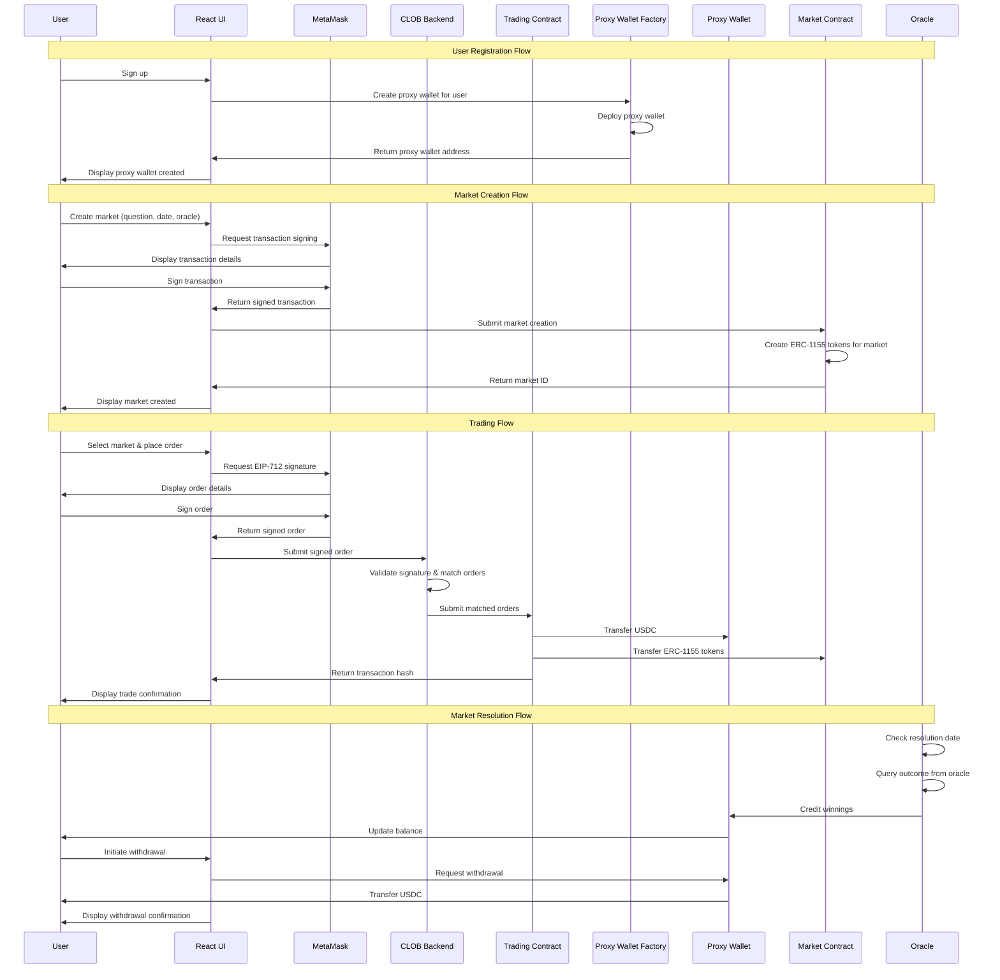

# Roadmap: Polymarket-Like Decentralized Prediction Market MVP

## Objective
Deliver a Minimum Viable Product (MVP) for a decentralized prediction market on the Polygon blockchain, enabling users to create markets, trade outcome shares via a hybrid decentralized Central Limit Order Book (CLOB), manage funds securely with wallet integration, and resolve markets using an oracle system. The MVP targets traders, market creators, and analysts, excluding developer-focused features like external APIs.

## Target Audience
- **Traders**: Users trading outcome shares (e.g., "Yes" or "No" tokens) in prediction markets.
- **Market Creators**: Users defining new markets with questions and outcomes.
- **Analysts**: Users viewing order book depth and market trends.

## Scope for MVP
- **User Wallet Integration**: Support MetaMask or a proxy wallet for secure USDC deposits, withdrawals, and trades.
- **Prediction Smart Contracts**: Deploy contracts for market creation, trading, and settlement using ERC-1155 tokens.
- **Hybrid Decentralized Order Book (CLOB)**: Off-chain order matching with EIP-712 signed transactions, settled on-chain via smart contracts.
- **Oracle Integration**: Use a UMA-like optimistic oracle for market resolution and dispute handling.
- **Market Lifecycle Management**: Support market creation, trading, resolution, and settlement.
- **Visualization**: Basic order book depth charts via Plotly, served through a React-based web UI.

## Exclusions for MVP
- External REST API for developers.
- Advanced analytics (e.g., historical trends, liquidity metrics).
- Multi-blockchain support (Polygon only).
- Complex UI features (e.g., advanced dashboards, mobile app).

## System Architecture
### Overview
The system is a decentralized application (dApp) on Polygon, combining an off-chain hybrid CLOB for order matching with on-chain smart contract execution, user wallet integration, and oracle-based resolution. Users sign EIP-712 transactions for orders, which are matched off-chain and settled on-chain, ensuring efficiency and transparency.

### Components
- **Frontend (User Interface)**:
  - **Tech**: React (CDN-hosted via `cdn.jsdelivr.net`), Tailwind CSS for styling, `ethers.js` for wallet interaction.
  - **Functionality**: Displays markets, order books, and depth charts; supports market creation, EIP-712 order signing, and fund management.
  - **Details**: Single-page application with components for market selection, order placement, and wallet interactions (connect, deposit, withdraw).

- **Backend (Python)**:
  - **Tech**: Python 3.12+, `web3.py` (blockchain interaction), `sortedcontainers` (CLOB), `aiohttp` (async API), `plotly` (visualization), `redis-py` (caching), `eth_account` (EIP-712 signature verification).
  - **Functionality**: Manages CLOB, validates signed orders, processes matches, submits trades to smart contracts, and generates visualizations.
  - **Details**: Handles off-chain order matching, submits matched orders to `Trading.sol`, and caches data for low-latency access.

- **Smart Contracts (Solidity)**:
  - **Contracts**:
    - **Market Contract**: Comprehensive contract managing all prediction markets, issuing ERC-1155 outcome tokens for each market.
    - **Trading Contract**: Executes EIP-712 signed matched orders with USDC settlement.
    - **Proxy Wallet Factory**: Creates proxy wallets for users with owner and Fox Market approval capabilities.
    - **Oracle Contract**: Interfaces with a UMA-like oracle for outcome resolution.
  - **Tech**: Solidity, web3.py + solcx for development/testing, OpenZeppelin for ERC-1155 and ERC-20 utilities.
  - **Details**: Contracts are gas-optimized (under 100,000 gas per trade) and deployed on Polygon mainnet or Mumbai testnet.

- **Data Layer**:
  - **Redis**: Caches real-time order book and market states (5-minute TTL).
  - **Polygon Blockchain**: Stores market data, trades, and funds via smart contracts.
  - **Details**: Redis ensures under 100ms read/write latency; blockchain uses Infura/Alchemy for reliable RPC access.

- **Oracle Integration**:
  - **Tech**: UMA-like optimistic oracle, accessed via `web3.py` and Solidity.
  - **Functionality**: Resolves market outcomes with a 2-hour dispute period; triggers payouts.
  - **Details**: Supports binary outcomes (Yes/No) with configurable dispute windows.

### Interactions
#### User Flow Narrative
The user flow outlines the end-to-end interaction for traders and market creators, covering fund management, market creation, trading, resolution, and withdrawal. Users interact via a React UI, sign EIP-712 transactions for orders, and rely on the hybrid CLOB and smart contracts for secure trading. Below is the detailed flow:

- **User Registration**: When a user signs up, the Proxy Wallet Factory creates a new proxy wallet for them. The proxy wallet allows both the user (owner) and Fox Market to approve changes to prediction market addresses.
- **Deposit USDC**: The user connects MetaMask via the UI and initiates a USDC deposit. The platform provides the user's proxy wallet address. The user sends USDC to their proxy wallet on Polygon.
- **Approve Funds**: The user approves USDC spending (ERC-20 `approve`) via their proxy wallet, allowing the Trading Contract to use funds for trades. This is a one-time approval per session for simplified UX.
- **Create Market**: Market creators use the comprehensive Market Contract to create new prediction markets. Each market gets unique ERC-1155 outcome tokens (e.g., Yes/No tokens) identified by market ID and outcome index.
- **Place Order**: The user selects a market (e.g., "Will Bitcoin exceed $60,000?") and places a bet by signing an EIP-712 order (market ID, outcome, price, quantity, signer, timestamp) using MetaMask. The wallet displays human-readable details (e.g., "Buy 100 Yes shares at 0.5 USDC"). The signed order is sent to the CLOB via a backend endpoint.
- **Order Matching**: The CLOB validates the EIP-712 signature, adds the order to the order book, and matches it against opposing orders (bid ≥ ask, price-time priority). Matched orders (buy/sell) are submitted to the Trading Contract with signatures for on-chain settlement.
- **Trade Execution**: The Trading Contract verifies signatures, transfers ERC-1155 outcome tokens to the buyer, and USDC to the seller. The UI displays a confirmation (e.g., "Bought 100 Yes shares at 0.5 USDC").
- **Market Resolution**: After the market's resolution date, the platform queries the UMA-like oracle for the outcome (e.g., Yes/No). The Oracle Contract resolves the market after a 2-hour dispute period, crediting winnings to the user's proxy wallet (e.g., one USDC per Yes token if Yes wins).
- **Withdrawal**: The user initiates a withdrawal via the UI, and their proxy wallet transfers USDC to the user's external wallet on Polygon. The UI confirms receipt of funds.

#### Sequence Flow Diagram

## Development Phases

### Phase 1: Foundation (Weeks 1-2)
- **Smart Contract Development**: Deploy Market Contract, Trading Contract, Proxy Wallet Factory, and Oracle contracts
- **Basic Backend**: Set up FastAPI with database models and basic endpoints
- **Docker Infrastructure**: Complete Docker setup with Ganache integration
- **Testing Framework**: Implement comprehensive testing for contracts and backend

### Phase 2: Core Features (Weeks 3-4)
- **Order Book Implementation**: Build hybrid CLOB with EIP-712 signature verification
- **Market Creation**: Implement market creation UI and backend integration with comprehensive Market Contract
- **Basic Trading**: Enable order placement and matching
- **Wallet Integration**: Connect MetaMask for deposits and withdrawals via proxy wallets

### Phase 3: Advanced Features (Weeks 5-6)
- **Order Matching Engine**: Complete the matching algorithm with price-time priority
- **Trade Settlement**: Implement on-chain trade execution
- **Oracle Integration**: Connect with UMA-like oracle for market resolution
- **UI Polish**: Enhance user interface with order book visualization

### Phase 4: Testing & Optimization (Weeks 7-8)
- **Performance Testing**: Load testing for order matching and settlement
- **Security Auditing**: Comprehensive security review of smart contracts
- **UI/UX Refinement**: Final polish of user interface
- **Documentation**: Complete technical and user documentation

## Success Metrics
- **Performance**: Under 100ms order book updates, under 5s trade settlement
- **Security**: Zero critical vulnerabilities in smart contracts
- **Usability**: Intuitive UI for market creation and trading
- **Reliability**: 99.9% uptime for core trading functionality

## Risk Mitigation
- **Smart Contract Security**: Multiple rounds of testing and auditing
- **Performance**: Load testing and optimization throughout development
- **User Experience**: Regular user testing and feedback incorporation
- **Technical Debt**: Maintainable codebase with comprehensive documentation 