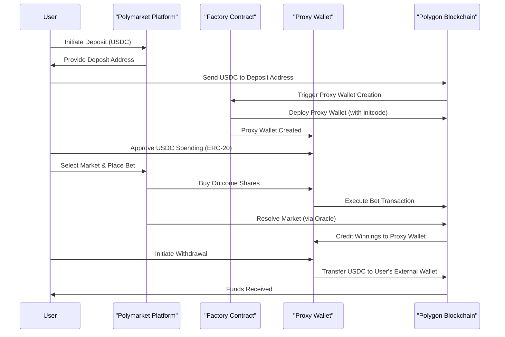

## Summary
A [proxy wallet](#glossary) is a smart contract-based wallet that acts as an intermediary between a user and a DApp (Decentralized Application). It abstracts asset management, enables upgradeable logic, and can significantly improve user experience and security for decentralized applications.

## Details

### How Proxy Wallets Work
- **Abstraction**: The proxy wallet holds the user's assets (e.g., ERC20, ERC1155 tokens) and interacts with DApps on their behalf.
- **Upgradeable Logic**: The wallet's logic can be upgraded or modified without changing the user's address, thanks to the proxy pattern.
- **User Experience**: Proxy wallets can abstract away blockchain complexities, enabling features like meta-transactions, batching, and gas sponsorship.

> **Note:**
> Proxy wallets can be implemented using different proxy patterns, such as [EIP-1967](https://eips.ethereum.org/EIPS/eip-1967) (standard storage slots) or [EIP-1167](https://eips.ethereum.org/EIPS/eip-1167) (minimal proxy/clone pattern), depending on your use case and gas optimization needs.

### Benefits for DApps
- **Enhanced Security**: Add transaction previews, fraud protection, and custom security policies.
- **Upgradeability**: DApps can introduce new features or fix bugs without requiring users to migrate assets or change wallet addresses.
- **Improved UX**: Users interact with a single wallet address, even as the underlying logic evolves.
- **On-chain Transparency**: All transactions are recorded on-chain, ensuring transparency and auditability.

> **Tip:**
> Proxy wallets are a key building block for [account abstraction](#glossary), which aims to make blockchain applications as user-friendly as Web2 apps.

## Use Case: Upgradeable Decentralized Exchange (DEX)

Imagine a DEX called **AwesomeDEX**. Initially, it offers basic trading. Later, developers want to add advanced features (e.g., limit orders). Without proxy wallets, users would need to migrate funds to a new contract. With proxy wallets, the upgrade is seamless:

1. **User interacts** with AwesomeDEX through their proxy wallet.
2. **Upgrade**: Developers deploy a new DEX contract and update the proxy wallet's implementation address.
3. **Seamless transition**: Users continue using the same wallet address; the proxy routes calls to the new DEX logic.

### Pseudo-Code Example
```solidity
// Proxy Wallet Contract
contract ProxyWallet {
    address public owner;
    address public implementation;  // Current DEX contract

    constructor(address _owner, address _implementation) {
        owner = _owner;
        implementation = _implementation;
    }

    function upgrade(address _newImplementation) external {
        require(msg.sender == owner, "Only owner can upgrade");
        implementation = _newImplementation;
    }

    fallback() external payable {
        address _implementation = implementation;
        assembly {
            calldatacopy(0x0, 0x0, calldatasize())
            let result := delegatecall(gas(), _implementation, 0x0, calldatasize(), 0x0, 0x0)
            returndatacopy(0x0, 0x0, returndatasize())
            switch result
            case 0 { revert(0x0, returndatasize()) }
            default { return(0x0, returndatasize()) }
        }
    }
}

// DEX Contract (V1)
contract AwesomeDEX {
    function swap(address _tokenIn, address _tokenOut, uint256 _amountIn) external {
        // ... swap logic ...
    }
}

// DEX Contract (V2 with Limit Orders)
contract AwesomeDEXV2 {
    function swap(address _tokenIn, address _tokenOut, uint256 _amountIn) external {
        // ... swap logic ...
    }
    function createLimitOrder(address _tokenIn, address _tokenOut, uint256 _amountIn, uint256 _price) external {
        // ... limit order logic ...
    }
}
```

> **Warning:**
> When using `delegatecall` in proxy wallets, always ensure the implementation contract is trusted and thoroughly audited. Improper use can introduce critical vulnerabilities, such as storage collisions or malicious upgrades.

### Who Owns the Assets?
- **User-Owned**: Typically, the user is the owner and only they can authorize transactions.
- **Contract-Controlled**: Sometimes, another contract manages the proxy wallet (e.g., for pooled funds).
- **Multi-Sig**: Multiple owners must approve actions for added security.

## Security Considerations
- **Upgradeability Risks**: Only allow trusted parties to upgrade the implementation. Use multi-sig or timelocks for added safety.
- **Key Management**: The owner key must be securely managed. Loss or compromise can result in loss of funds.
- **Delegatecall Hazards**: Always audit implementation contracts for storage layout compatibility and security.
- **Access Controls**: Restrict sensitive functions (like `upgrade`) to authorized addresses only.

## Tooling & Testing
- Use [OpenZeppelin Upgrades](https://docs.openzeppelin.com/upgrades-plugins/1.x/) for secure proxy patterns and upgrade management.
- Test with frameworks like [Hardhat](https://hardhat.org/) or [Foundry](https://book.getfoundry.sh/) to simulate upgrades and edge cases.
- Consider static analysis tools (e.g., Slither, MythX) for security checks.

> **Note:**
> Deploying a proxy wallet has a one-time gas cost. Gas savings are realized through batching, meta-transactions, and upgradeability over time.

## Polymarket Example: Proxy Wallets in Practice

Polymarket uses proxy wallets to simplify onboarding and optimize gas usage:
- **Account Abstraction**: New users get a proxy wallet, so they don't need to manage a traditional wallet immediately.
- **Batching & Meta-Transactions**: Proxy wallets can batch multiple actions or allow Polymarket to sponsor gas fees, making the experience smoother and potentially gasless for users.
- **Upgradeability**: As Polymarket adds features, proxy wallets can be upgraded without requiring users to migrate funds.
- **Custom Security**: Proxy wallets can enforce transaction limits, whitelisting, or multi-sig for extra protection.

### Contract Factory Pattern
Polymarket likely uses a [contract factory](#glossary) to deploy proxy wallets for users:
- The factory contract creates new proxy wallets and assigns ownership to the user.
- This centralizes deployment, optimizes gas, and ensures consistent wallet logic.

#### Example Flow
1. User signs up on Polymarket.
2. Factory contract deploys a new proxy wallet for the user.
3. User interacts with Polymarket through their proxy wallet, benefiting from abstraction, upgradeability, and gas optimizations.

## Polymarket Proxy Wallet Lifecycle: Flow Sequence




## See Also
- [Account Abstraction](#) (if you have a dedicated doc)
- [Contract Factory Pattern](#) (if you have a dedicated doc)
- [Security Best Practices](#) (if you have a dedicated doc)

## References
- [OpenZeppelin Proxy Pattern](https://docs.openzeppelin.com/upgrades-plugins/1.x/proxies)
- [EIP-1967: Proxy Storage Slots](https://eips.ethereum.org/EIPS/eip-1967)
- [EIP-1167: Minimal Proxy Contract](https://eips.ethereum.org/EIPS/eip-1167)
- [Polymarket Docs](https://docs.polymarket.com/)
- [Hardhat](https://hardhat.org/)
- [Foundry](https://book.getfoundry.sh/)
- [Slither](https://github.com/crytic/slither)
- [MythX](https://mythx.io/) 

