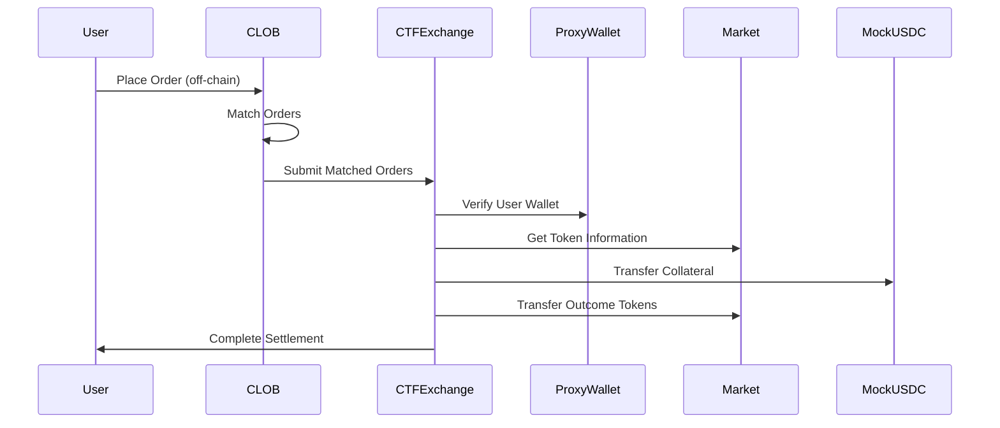

# Smart Contract Interactions

## Overview

Fox Market uses a hybrid-decentralized architecture that combines off-chain order matching (CLOB) with on-chain settlement. This design provides the speed and efficiency of centralized exchanges while maintaining the security and non-custodial nature of decentralized systems.

## Architecture Components

### Core Smart Contracts

#### **1. CTFExchange (Main Trading Contract)**
Based on Polymarket's CTF Exchange, this is the primary contract for executing trades.

**Key Features:**
- **Atomic Swaps**: Facilitates atomic swaps between ERC1155 outcome tokens and ERC20 collateral
- **Hybrid Model**: Off-chain matching with on-chain settlement
- **EIP-712 Signatures**: Secure order signing and verification
- **Multiple Signature Types**: EOA, POLY_PROXY, POLY_GNOSIS_SAFE
- **Fee Management**: Symmetric fee collection and distribution

**Core Functions:**
```solidity
// Order execution
function fillOrder(Order memory order, uint256 fillAmount) external
function fillOrders(Order[] memory orders, uint256[] memory fillAmounts) external
function matchOrders(Order memory takerOrder, Order[] memory makerOrders, ...) external

// Configuration
function setProxyFactory(address _newProxyFactory) external
function registerToken(uint256 token, uint256 complement, bytes32 conditionId) external
```

#### **2. ProxyWalletFactory (User Wallet Management)**
Factory contract for creating deterministic proxy wallets for users.

**Key Features:**
- **Deterministic Deployment**: Same address for same user across networks
- **Gas Optimization**: Minimal proxy pattern for efficient deployment
- **User Management**: Centralized wallet creation and tracking

**Core Functions:**
```solidity
function createProxyWallet(address user) external returns (address wallet)
function getProxyWallet(address user) external view returns (address)
function isProxyWalletAddress(address wallet) external view returns (bool)
```

#### **3. MockUSDC (Collateral Token)**
Test implementation of USDC for development and testing.

**Key Features:**
- **ERC-20 Standard**: Compatible with existing DeFi infrastructure
- **Minting Capability**: For testing and development
- **6 Decimals**: Matches real USDC precision

#### **4. Market (Token Management)**
Comprehensive contract for managing prediction market tokens (ERC-1155).

**Key Features:**
- **Market Creation**: Dynamic market setup with multiple outcomes
- **Token Management**: ERC-1155 token minting and burning
- **Outcome Resolution**: Automated settlement based on oracle data

## Integration with CLOB System

### **Data Flow**



### **Order Processing**

#### **1. Order Creation (Off-chain)**
```javascript
// User creates order with EIP-712 signature
const order = {
    salt: generateRandomSalt(),
    maker: userAddress,
    signer: userAddress,
    taker: address(0), // Public order
    tokenId: outcomeTokenId,
    makerAmount: 1000, // USDC amount
    takerAmount: 500,  // Token amount
    expiration: block.timestamp + 3600,
    nonce: userNonce,
    feeRateBps: 30, // 0.3%
    side: Side.BUY,
    signatureType: SignatureType.POLY_PROXY
};
```

#### **2. Order Matching (CLOB)**
```python
# CLOB matches orders based on price-time priority
matched_orders = clob_service.match_orders(buy_orders, sell_orders)
```

#### **3. Order Execution (On-chain)**
```solidity
// CTFExchange executes matched orders atomically
ctfExchange.matchOrders(
    takerOrder,
    makerOrders,
    takerFillAmount,
    makerFillAmounts
);
```

### **Signature Verification**

The system supports three signature types:

#### **1. EOA (Externally Owned Account)**
```solidity
function verifyEOASignature(address signer, address maker, bytes32 structHash, bytes memory signature)
    internal pure returns (bool)
{
    return (signer == maker) && verifyECDSASignature(signer, structHash, signature);
}
```

#### **2. POLY_PROXY (Proxy Wallet)**
```solidity
function verifyPolyProxySignature(address signer, address proxyWallet, bytes32 structHash, bytes memory signature)
    internal view returns (bool)
{
    return verifyECDSASignature(signer, structHash, signature) && 
           getPolyProxyWalletAddress(signer) == proxyWallet;
}
```

#### **3. POLY_GNOSIS_SAFE (Gnosis Safe)**
```solidity
function verifyPolySafeSignature(address signer, address safeAddress, bytes32 hash, bytes memory signature)
    internal view returns (bool)
{
    return verifyECDSASignature(signer, hash, signature) && 
           getSafeAddress(signer) == safeAddress;
}
```

## Contract Architecture: CTF-Based Design

### Why CTF Exchange Architecture?

The Fox Market system adopts Polymarket's CTF Exchange architecture for several key reasons:

#### **1. Proven Security Model**
- **Audited Contracts**: CTF Exchange has been audited by ChainSecurity
- **Battle-Tested**: Used in production by Polymarket
- **Best Practices**: Implements industry-standard security patterns

#### **2. Hybrid Decentralization**
- **Off-chain Matching**: Fast order matching via CLOB
- **On-chain Settlement**: Secure, non-custodial settlement
- **Operator Model**: Centralized efficiency with decentralized security

#### **3. Flexible Signature System**
- **Multiple Wallet Types**: EOA, Proxy Wallet, Gnosis Safe
- **Deterministic Addresses**: Same proxy wallet address across networks
- **Gas Optimization**: Minimal proxy pattern for efficient deployment

### Current Design: CTF-Based Architecture

#### **Pros of CTF Architecture**

##### 1. **Proven Security**
- Audited by ChainSecurity
- Used in production by Polymarket
- Implements industry best practices

##### 2. **Hybrid Efficiency**
- Fast off-chain matching
- Secure on-chain settlement
- Best of both worlds

##### 3. **Flexible Wallet Support**
- Multiple signature types
- Deterministic proxy wallets
- Gas-optimized deployment

##### 4. **Standard Compliance**
- EIP-712 signature standard
- ERC-1155 token standard
- ERC-20 collateral standard

##### 5. **Scalable Architecture**
- Modular design with mixins
- Easy to extend and customize
- Clear separation of concerns

#### **Cons of CTF Architecture**

##### 1. **Complexity**
- More contracts to manage
- Steeper learning curve
- More complex deployment

##### 2. **Gas Costs**
- Multiple contract interactions
- Proxy wallet deployment costs
- Cross-contract calls

##### 3. **Dependency on External**
- Relies on Polymarket's architecture
- Limited customization options
- Potential version lock-in

### Alternative: Simplified Architecture

#### **Pros of Simplified Design**

##### 1. **Easier to Understand**
- Single contract for trading
- Simpler deployment process
- Clearer codebase

##### 2. **Lower Gas Costs**
- Fewer contract interactions
- No proxy wallet overhead
- Direct token transfers

##### 3. **Full Control**
- Complete customization
- No external dependencies
- Independent development

#### **Cons of Simplified Design**

##### 1. **Security Risks**
- Untested architecture
- Potential vulnerabilities
- No audit history

##### 2. **Limited Features**
- Basic functionality only
- No advanced wallet support
- Limited signature types

##### 3. **Scalability Issues**
- Harder to extend
- Monolithic design
- Difficult to upgrade

### Recommendation: CTF-Based Architecture

For the Fox Market system, we recommend **adopting the CTF-based architecture** because:

#### **1. Production Readiness**
- Proven in production by Polymarket
- Comprehensive security audit
- Battle-tested codebase

#### **2. Advanced Features**
- Multiple wallet support
- Deterministic addresses
- Flexible signature system

#### **3. Industry Standards**
- EIP-712 compliance
- ERC-1155 token support
- Hybrid decentralization

#### **4. Future Flexibility**
- Modular design
- Easy to extend
- Scalable architecture

### Integration Strategy

#### **Phase 1: Core Integration**
1. **Deploy CTFExchange** with our customizations
2. **Implement ProxyWalletFactory** for user management
3. **Create MockUSDC** for testing
4. **Integrate with CLOB** for order matching

#### **Phase 2: Advanced Features**
1. **Add Market contract** for token management
2. **Implement Oracle integration** for outcome resolution
3. **Add advanced fee management**
4. **Implement batch operations**

#### **Phase 3: Optimization**
1. **Gas optimization** for common operations
2. **Batch processing** for multiple orders
3. **Advanced order types** (stop-loss, etc.)
4. **Cross-chain compatibility**

## Security Considerations

### **1. Signature Verification**
- All orders must be properly signed
- Multiple signature types supported
- Deterministic address verification

### **2. Reentrancy Protection**
- All external calls protected
- State changes before external calls
- Comprehensive testing

### **3. Access Control**
- Admin-only functions protected
- Proper role management
- Emergency pause functionality

### **4. Gas Optimization**
- Efficient proxy wallet deployment
- Minimal cross-contract calls
- Optimized data structures

## Testing Strategy

### **1. Unit Tests**
- Individual contract functions
- Signature verification
- Access control

### **2. Integration Tests**
- End-to-end order flow
- CLOB integration
- Cross-contract interactions

### **3. Security Tests**
- Reentrancy attacks
- Signature forgery
- Access control bypass

### **4. Gas Tests**
- Deployment costs
- Operation costs
- Optimization verification

## Bottom Line

The CTF-based architecture provides a robust, secure, and scalable foundation for Fox Market. While it introduces some complexity, the benefits of proven security, advanced features, and industry standards outweigh the costs. The hybrid approach of off-chain matching with on-chain settlement provides the best user experience while maintaining decentralization. 